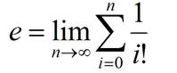
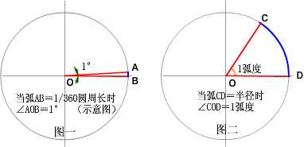

# math 库

aardio 数学函数库

| 函数定义 | 说明 | 示例 |
| --- | --- | --- |
| math.size64(      数值低位,数值高位       ) | 创建64位无符号长整数(无符号指没有负数，即没有符号位)，构造参数可以是一个或两个数值或字符串指定的数值,也可以用于复制其他math.size64创建的对象()，返回值可兼容API类型中的LONG类型(无符号长整数)   注意aardio普通数值表示的有效整数范围在正负 (2\*\*53 - 1) 之间，而math.size64可以使用64个二进制位表示更大的正整数. | var size = math.size64(1,2); size.add(2); var size2 = size + 3; import console; console.log( size2.format(),size2 )  |
| math.randomize() | 设置随机数种子，用于改变随机数队列。 math.randomize 的参数可以是一个任意的数值，省略参数时，则自动生成一个安全的随机数作为随机数种子。 aardio 程序在启动时，主线程会以 time.tick 获得的系统启动毫秒数作为参数调用一次 math.randomize。在创建新的线程时也会自动调用 math.randomize，但不会使用系统启动毫秒数作为参数，而是自动生成一个安全的随机数作为随机数种子。   参考：[随机数](string/rand.md)   | math.randomize()  |
| math.random(min,max)  | 获取随机数  参考：[随机数](string/rand.md) | math.random(5, 99) //返回\[5,99\]之间的随机数  math.random() 返回(0,1)之间的小数 |
| math.pi | 圆周率常量 | 3.14159265358979323846 |
| math.abs(x) | 取绝对值 |x| = math.abs(x) | math.abs(-20) |
| math.ceil(x) | 上取整为最接近的整数    math.ceil(x) == ⌈x⌉ | math.ceil(4.5) |
| math.floor(x) | 
下取整为最接近的整数  math.floor(x) == ⌊x⌋
 | math.floor(4.5) |
| math.round(x) | 四舍五入取整 | math.round(4.6) //结果为5  math.round(4.2) //结果为4    math.round = function(n){     return math.floor(n+0.5) }  |
| 
数
 
学
 
知
 
识
 
回
 
顾
 | 对于所有实数x:  
 x-1 < ⌊x⌋ <= x <= ⌈x⌉ < x+1     对于所有整数x:  
⌊x/2⌋ + ⌈x/2⌉ == x a % b == a - ⌊a/b⌋ b |
| math.sqrt(x) | 开平方函数 | math.sqrt(25) |
| math.log10(x)  | 计算以10为基数的对数 | math.log10(200) |
| math.log(x)  | 计算一个数字x的自然对数(以e为底) | math.log(2.5)  自定义底数:  `lambda(n,b) math.log(n) / math.log(b)` |
| 
数
 
学
 
知
 
识
 
回
 
顾
 | 
在式子 102 = 100 中   其中10为底数,2为指数,100为幂数  100是10的2次幂， 2是100的对数(以10为底数) 。    1. 由底数10,指数2得到幂数100的运算称为乘方运算：  
 
10\*\*2 == 100 
 
2. 由幂数100,指数2得到底数10的运算称为开方运算：  
 
100\*\*(1/2) == 10  开2次方也可以使用函数：math.sqrt(100) == 10

3. 由底数10,幂数100得到指数2的运算是对数运算： 

 math.log10(100) == 2
  在上面的对数运算里，10为底数、100为真数，2为对数。  2是100的对数(以10为底数)。记为：log10100 = 2

以e为底的对象称为自然对数。100的自然对数记为：loge100 
 |
| math.e   |  
自然对数的底数 e 。  e=1+1/1!+1/2!+1/3!+…&asymp;2.718281828459  计为：  
“!”表示阶乘符号．通常跟在一个自然数的后面。如：  3!＝3×2×1   5!＝5×4×3×2×1 
 
 |
| math.exp(x) | 计算以 math.e 为底 x 次方值，等价于 `math.e ** x` | math.exp(2) |
| math.ldexp(m,n) | 已知尾数m 和指数n ，返回数字x  (方程式：`x = m * 2**n`)。 | `math.ldexp(0.625, 5)`  |
| math.frexp(x) | 返回数字x 的尾数m 和指数n (方程式：`x = m * 2**n`) | `math.frexp(20)` |
| 
数
 
学
 
知
 
识
 
回
 
顾
 | 
在 aardio 中可以使用科学计数法表示数值。    科学计数法将一个数字表示成 ( a \* 10的n次幂的形式 ) ，记为：aEn 其中 a 为尾数，而n为指数。  尾数的范围通常是 1.0 &lt;= &#x7c;x&#x7c; < 10.0     例如：  `1E+09 `表示1\*10的9次方 `1E-02 `表示`1*10`的负2次方，即`1 *10` 的2次幂分之一，即`0.01`
 
  
 |
| math.max(n,n2,...) | 取得数中最大值 | math.max(2,3,4,5) |
| math.min(n,n2,...) | 取得参数中最小值 | math.min(2,3,4,5) |
| math.modf(x) | 把数分为整数和小数 | math.modf(23.45) |
| math.rad(x) | 角度转弧度 | math.rad(180) |
| math.deg(x) | 弧度转角度 | math.deg(math.pi) |
| 
数
 
学
 
知
 
识
 
回
 
顾
 | 
“角度”和“弧度”是度量角大小的两种不同的单位。  就像“米”和“市尺”是度量长度大小的两种不同的单位一样。      角度：两条射线从圆心向圆周射出，形成一个夹角和夹角正对的一段弧。当这段弧长正好等于圆周长的360分之一时，两条射线的夹角的大小为1度，（如图一）     弧度：两条射线从圆心向圆周射出，形成一个夹角和夹角正对的一段弧。当这段弧长正好等于圆的半径时，两条射线的夹角大小为1弧度。（如图二）         半圆的长度是半径的 π倍，所以一个平角（180度）是 π弧度。 即：180度＝π弧度     角度＝弧度×180/π   弧度＝角度×π/180  
 |
|   | 三 角 函 数 |
| 
数
 
学
 
知
 
识
 
回
 
顾
 | 
三角函数（Trigonometric）是数学中属于初等函数中的超越函数的一类函数。它们的本质是任意角的集合与一个比值的集合的变量之间的映射。通常的三角函数是在平面直角坐标系中定义的，其定义域为整个实数域。

<h3>直角三角定义：</h3> 在数学中，三角函数（也叫做圆函数）是角的函数。三角函数通常定义为包含这个角的直角三角形的两个边的比率 。在平面直角坐标系xOy中，从点O引出一条射线OP，设旋转角为θ，设OP=r，P点的坐标为（x，y）        **正弦函数** sinα=y/r   sin:角α的对边 比 斜边 　　    **余弦函数** cosα=x/r   cos:角α的邻边 比 斜边 　　    **正切函数** tanα=y/x   tan:角α的对边 比 邻边 　　    **余切函数** cotα=x/y   cot:角α的邻边 比 对边     **正割函数** secα=r/x   sec: 角α的斜边 比 邻边 　    **余割函数** cosecα=r/y   cosec: 角α的斜边 比 对边 　　   
 
sinα定义域无穷，值域 \[-1,1\]   cosα定义域无穷，值域 \[-1,1\] 即  tanα的定义域(-π/2+kπ,π/2+kπ)，k属于整数，值域无穷  
在数学中：中括号表示闭区间,小括号表示开区间，例如：    \[-1,1\] 表示 -1 <= x and x <= 1  (-1,1) 表示 -1 < x and x < 1  \[-1,1) 表示 -1 <= x and x < 1 
    
 |
| math.sin(x) | 正弦函数 | math.sin(math.rad(35)) |
|   | 余割(cosec) 是正弦(sin)的倒数：    cosec(x) == 1/math.sin(x) |
| math.asin(x) | 反正弦函数 | math.asin(0.5) |
| math.sinh(x) | 双曲线正弦函数 | math.sinh(0.5) |
| math.cos(x) | 余弦函数 | math.cos(0.5) |
|   | 正割(sec) 是余弦(cos)的倒数：    sec(x) == 1/math.cos(x) |
| math.acos(x) | 反余弦函数 | math.acos(0.5) |
| math.cosh(x) | 双曲线余弦函数 | math.cosh(0.5) |
| math.tan(x) | 正切函数 | math.tan(0.6) |
| math.atan(x) | 反正切函数 | math.atan(0.5) |
|   | 余切(cot) 是正切(tan)的倒数：    cot(x) == 1/math.tan(x) |
| math.atan2(y,x) | x / y的反正切值 | math.atan2(45,25) |
| math.tanh(x) | 双曲线正切函数 | math.tanh(0.6) |