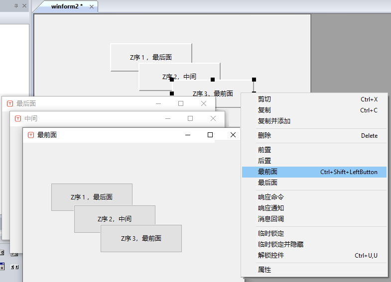

# Z 序：原理与优化

Z 序是使用原生窗口开发图形界面最重要的基础知识。

如果不了解 Z 序的原理与优化方法，可能遇到很多问题会理解不了，更不要说解决问题了。

## Z 序

以 X 轴表示屏幕或窗口上的横坐标，Y 轴表示纵坐标，而 Z 轴表示的是窗口在屏幕上的前后叠加顺序。

Z 序就是指窗口在 Z 轴上的排序。  

具体到一个窗口指的就是窗口内的控件在 Z 轴上的排序，控件也是窗口（父窗口内的子窗口）。

我们在开发界面时需要了解和处理的 Z 序问题通常指的是控件的 Z 序，也就是子窗口的 Z 序。

当你打开 aardio，从工具箱里往窗体上拖放控件，先放上去的 Z 序较小，后放上去的 Z 序较大。 在运行时默也会先创建 Z 序较小的控件。  
  
可以理解为：窗口内部有一个数组维护了所有子窗口的句柄，按 Z 序从小到大依次排列。  
  
  
  
在窗口设计器中，可以在控件上使用鼠标右键点击，  
在弹出的右键菜单中点击【前置 / 后置 / 最前面】 等菜单项调整 Z 序。  
  
移动控件到【最前面】的快捷键是：Ctrl + Shift + 鼠标左键。  
如果按住 Ctrl + Shift + 鼠标左键 依次点击所有控件，就是重排全部 Z 序。注意 Tab 键切换焦点顺序等于 Z 序。  

从窗体 "设计视图" 切换到 "代码视图"，查看设计器生成的控件代码如下：

```aardio
import win.ui; 
var winform = win.form(text="aardio form")
winform.add(
button1={cls="button";text="Button";left=51;top=72;right=326;bottom=151;z=1};
button2={cls="button";text="Button";left=157;top=121;right=368;bottom=172;z=2}
) 

winform.show();
win.loopMessage();
```

可以看到 winform.button1 的创建参数里用 `z=1` 指定了 Z 序为 1。
而 winform.button2 的创建参数里用 `z=2` 指定了 Z 序为 2 。
  
## Z 序与默认绘图顺序  

默认的控件会按 Z 序从小到大显示，也就是先创建的控件先显示，后创建的控件后显示。  
  
## Z 序与事件触发顺序   

其实窗口上的控件默认对前后叠放支持得不好，如果你将控件前后叠放，从理论上来说：后面的控件先触发。  

所以有时候你会遇到这种怪异的现象，很奇怪为什么后面的控件先接受到事件了呢？例如拖放文件消息就有这个问题，其实窗口内部分法消息时是按 Z 序来分发的，这就导致默认显示在后面的 Z 序较小的控件先收到消息。  
  
## Z 序与动态控件  

动态控件指的是该控件可以响应用户事件（例如用户点击按钮时触发 oncommand 事件），  
静态文本框、图片框、以及 plus 控件默认都是静态控件，默认不处理鼠标按键事件，除非设置"事件回调"属性为 true，也就是在控件的创建参数中指定 `notify=true`。在窗体设计器中双击控件添加事件会自动启用"事件回调"并在控件创建参数中增加 `notify=true`。

静态控件通常可以前后叠放（注意不是绝对的），而动态控件就不同了。当你将两个按钮前后叠放，结果是你点谁，谁就会跑到前面。  
  
> 要点：静态控件通常可以在属性中设置【事件回调】为 true，使之可以响应鼠标、按钮变成**动态控件**。  
  
## Z 序与 _WS_CLIPSIBLINGS 样式

_WS_CLIPSIBLINGS 也就是 WS_CLIPSIBLINGS，在 aardio 中这些系统 API 常量前面都需要增加一个下划线。

在控件属性中设置【重叠裁剪】为 true，就会为控件添加 _WS_CLIPSIBLINGS 样式，添加了该样式的控件，他总是让 Z 序比他小的控件穿透他显示在前面，也就是说如果所有控件都加了这个样式，控件显示的顺序就会反过来。大家可以拖几个控件，全选然后修改该属性设一下。  

添加了 _WS_CLIPSIBLINGS 样式以后，即使是动态控件也可以相互重叠，互不干扰。这个等于是在前面的控件中剪切掉一个矩形显示后面的控件，所以外形不规则的控件就尴尬了，大家可以自行试试。  
  
桌面上的顶层窗体（独立窗体）都默认具有 _WS_CLIPSIBLINGS 样式，而且你无法移除。  
所以顶层窗体总是 Z 序最小的显示在前面，而且他们相互剪切，绘图互不干扰。  
  
## 内部裁剪样式 _WS_CLIPCHILDREN

_WS_CLIPSIBLINGS 是剪切同级窗口，而内部裁剪样式 _WS_CLIPCHILDREN  是用来剪切子窗口的。简单地说【内部裁剪】就是在绘制窗口时忽略该窗口上的所有子窗口，最常见的就是用于 COM 控件。以 web.form 为例，例如我们这样写 ：

```aardio
import web.form;
var wb = web.form(mainForm.custom);
wb.go("https://example.com");
```

这时 mainForm.custom 控件就成为网页控件的宿主控件，实际上网页完全填充并覆盖了 mainForm.custom 控件，那么这时候 mainForm.custom 自身的绘制就变得不必要了 —— 多绘制一次反而带来不必要的闪烁（当然足够快可能不明显），有时候宿主控件重绘了 —— 内部的 COM 控件没有正确重绘会导致显示出现问题，这时候我们就可以指定 mainForm.custom 的 【内部裁剪】属性为 true ，也就是为 mainForm.custom 加上 _WS_CLIPCHILDREN  样式。  
  
千万不要跑去给 mainForm 加上 _WS_CLIPCHILDREN  样式 —— 来解决 mainForm.custom 的问题，这就好像张三头疼，你却跑去给李四吃头疼药 —— 把李四吃坏了张三还没冶好。

然，我们了解这个原理就行了，实际上现在 aardio 中嵌入 COM 控件时会自动处理好这个问题，如果宿主控件是 static 这样的普通控件则加上 _WS_CLIPCHILDREN  样式，如果宿主控件是 win.form 这样的窗口对象 —— 则会定义 onEraseBkgnd 以禁止绘制窗口背景。结果都是一样由 COM 控件自己负责绘制宿主控件内容。  
  
## Z 序与 _WS_EX_TRANSPARENT 样式  

如果你在设计器的控件属性面板中设置【浮动透明】属性为 true，就会为控件添加 _WS_EX_TRANSPARENT 样式，  
这个名字比较误导，实际上他大多时候并不能使控件真正实现透明效果，窗体会延后所有具有 _WS_EX_TRANSPARENT 样式的控件的绘图顺序，默认会按 Z 序从小到大显示所有的控件，然后再显示所有的 _WS_EX_TRANSPARENT 样式控件。  
  
如果父窗体指定了【内部剪切属性】：也就是添加 _WS_CLIPCHILDREN 样式，那么默认的每次重绘他不会绘制子窗口。但是具有 _WS_EX_TRANSPARENT 样式的子窗口他会去重绘他，因为这个控件说了自己要透明，父窗口的背景重绘就无条件地触发控件的重绘。  
  
具有 _WS_EX_TRANSPARENT 样式的控件，在你调用 redraw() 函数手动重绘时，他会主动去刷新父窗口的背景（当然这是 aardio 标准库添加的一步 ）。如果不做这一步，那么上次绘图的残影会留下来。但是从上面可以看出，这种透明是很低效的，每次重绘都有可能触发多个窗口的重绘，处理不好会产生闪烁感。  
  
## 窗口绘图为什么会闪烁  

实际上你把图像画到屏幕上，这个速度是有点慢的，如果一个窗口包含几十个控件，那么每重绘一次，他就要画几十次以上，实际产生的绘图次数上远不止几十次。往屏幕上绘图慢，而绘图之间又有多多少少的间隔，那么正常地显示一帧的图像，就变成了数十帧停顿显示的图像，人眼看上去就是闪烁感了。所以现在有一些 DirectUI 的技术，去掉了这种机制，图像在内存中生成，只要把改变的图像画一次就可以了，因为这个速度极快，人眼感觉不出来，所以看上去非常的流畅。但是经过很多年 DirectUI 并没有真正成为一个更好解决问题的方案，唯有 Web UI 发展较好。

但是要考虑到 Web UI 毕竟不是主要为桌面软件图形界面所设计的，而传统窗口架构则是为这个目的而生。如果适合的技术用到适合的地方，使用传统窗口去开发界面可以做到更快更高效，而且也并不是所有软件都需要展现 Web 风格的排版。

传统控件如果产生了闪烁，通常可以使用下面的一些解决方案：

1. 处理 _WM_ERASEBKGND 消息返回 0，如果是窗体可以直接处理 winform.onEraseBkgnd 事件并返回 0，一个窗口绘图大多会分为两步走，在 _WM_ERASEBKGND 消息里擦除背景，在 _WM_PAINT 里绘前景图，很多时候这种分步走的绘图会产生不必要的闪烁，例如你放一个网页控件，网页本身就会绘制背景，如果控件也擦除一次背景，就会快速的看到一次灰色的闪屏，这时候可以用这个方法去掉这个不必要的过程。  
2. 在父窗体添加 _WS_CLIPCHILDREN 样式（ 可以在属性面板中直接设置窗体的 【内部剪切】属性为 true )，这样父窗体就不会管所有的子窗口了，所有控件自己负责绘制背景，但是如果有的控件要透明就尴尬了，因为父窗口背景是残缺的，这时候你可以为控件添加 _WS_EX_TRANSPARENT 样式（也就是在控件属性里设置【浮动透明】为 true），他会告知父窗体不要剪切自己并绘制自己需要的背景（当然这样搞，前面闪烁的问题又来了）。
3. 为控件添加 _WS_CLIPSIBLINGS 样式（ 也就是在控件属性面板中设置【重叠裁剪】为 true ) 。
4. 为窗体启用 _WS_EX_COMPOSITED 样式（ 也就是在窗体的属性中设置【双缓冲】为 true ), 启用双缓冲可以更好的支持浮动透明样式解决闪烁问题，详见下一节。  
  
## 窗体双缓冲优化  

在窗体中有一个【双缓冲】属性，如果启用该属性则为窗体添加 _WS_EX_COMPOSITED 样式以启用系统提供的双缓冲优化功能。如果窗体具有这个样式，所有的控件会被合成后再显示出来，也就是减少了绘图次数，去掉了闪烁感。  
  
_WS_EX_COMPOSITED 样式会让所有的控件显示顺序反过来，这个样式虽然似乎是一个“完美”的方案，但是他存在不少的BUG, 例如他在 XP 系统上不支持 GDI+( 但是使用 plus 控件没有这个限制 ) 在 win7 上会让不规则窗口失效，另外有不少控件例如 listview 不支持该功能( HTMLayout 作为子窗口时也不支持双缓冲 )，不过 plus 控件可以较好的支持 _WS_EX_COMPOSITED （因为 plus 控件仅使用 GDI+ 绘制内存 DC），双缓冲模式如果在刷新plus控件时闪烁，请将plus控件的【剪切背景】设为 false，将【浮动透明】设为 true（ 启用双缓冲的一个好处是可以更好的支持浮动透明样式 ）。  
  
如果你的窗体使用了 _WS_EX_COMPOSITED 样式，记住在不同操作系统上分别做一下测试，如果显示正常就没有问题，因为这个样式有时候会有一些怪异的BUG。  
  
## 为什么很多传统控件不支持透明图像  

看了前面绘图闪烁的原因，大家可以理解了，如果控件都可以透明，按传统控件的这种机制，每个控件重绘都要先去重绘他后面的控件或背景，那么界面就会闪得无法忍受了，性能不不会太好。其实用 GDI+ 画个透明图像是很容易的，但是要做到自由的透明变换并且不闪烁那不太容易。  
  
## 解决方案：plus 控件如何支持透明图像、动画、又能做到不闪烁  <a id="plus" href="#plus">&#x23;</a>

首先 plus 控件支持背景图像、前景图像等等，然后在内存中一次性的把图像进行合成并创建缓存。在绘图时使用了双缓冲优化，这就减少了绘图的次数，使绘图的速度极快，看上去就会非常流畅。而且 plus 控件使用了 GDI+，所以可以支持透明的 GIF，半透明的 png，以及透明字体颜色。  
  
plus 控件放弃了那种过度追求完美的设计思想，针对最常用的方式进行了优化处理。例如【剪切背景】功能针对直接放在窗体上的控件做了背景优化：他会把自己所需要的父窗口原始的背景剪切并缓存下来，合并到自己的缓存图像中。  使两次绘图变为一次，从而去掉闪烁感。  
  
这非常有用：如果你的 plus 控件上的图像会在运行时不断变换，并且透明的外形是不规则的并且会变化的（即背景会被反复破坏需要重绘），使用【剪切背景】可以使图像可以流畅地透明，透明动画效果也非常流畅。  
  
当然其缺点是剪切了父窗口的背景，如果他后面有其他的控件就会被忽视并穿透，如果要避免这一点：就要把【剪切背景】设为 false，失去了这种优化你就要注意：如果图像是透明的并且会变换，那么请保持所有变换的图像有一致的外形，以避免破坏背景（注意一下很多不规则按钮的设计，他们在不同状态下外形是一致的 - 这可以在切换绘图的时获得较好的显示效果）。  

当然，只要善于运用，缺点也可以变成优点，例如运用 plus 控件这种【剪切背景】的特性，可以轻松地[实现漂亮的组合框效果](../../../../example/plus/groupBox.aardio) 。
  
如果必须要在后面放其他的控件，并且透明图像是会变换的、外形也是会变换的，这时候可以启用【浮动透明】（即添加 _WS_EX_TRANSPARENT 样式），当然 _WS_EX_TRANSPAREN 会增加闪烁感，这时候可以启用窗体的双缓冲优化（即添加 _WS_EX_COMPOSITED 样式 ）获得更好的显示效果。  
  
## 解决方案：使用 bk,bkplus 控件实现重叠背景贴图  

我们现在已经知道，传统窗口上的控件重叠是比较麻烦的，aardio 为了更好地解决这个问题，提供了 bk,bkplus 这几个纯背景贴图控件 —— 这种控件是无窗口的、静态的、虚拟的控件。bk,bkplus 控件并不会真的创建窗口，仅仅是用于在窗口背景上贴图。这种控件在窗口背景绘图的同时绘制，不会增加闪烁感。而且也像直实控件一样 —— 支持固定边距、自适应缩放等控件布局属性。  
  
bk,bkplus 控件可以作为其他控件(包括 plus 控件）的背景，并且可以任意重叠组合。这比直接指定窗口背景图像更灵活。使用 bk,bkplus 控件，我们可以指定窗体背景上任何一小块背景的图像、颜色、或者布局、拉伸规则。  
